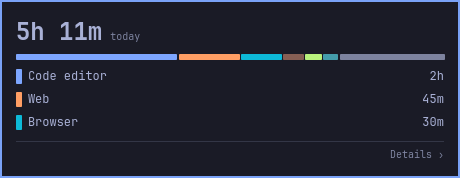
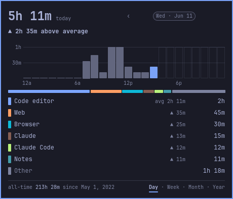
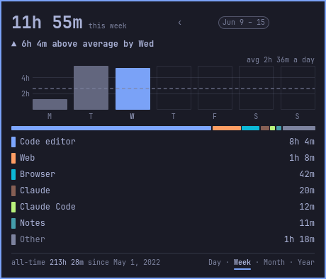
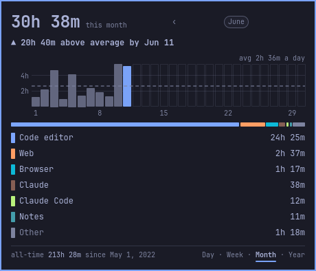
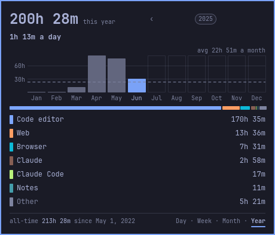

# Kanso Screen Time

Kanso (簡素): simplicity by removing clutter. Screen time for Omarchy, kept quietly: per-app, terminal-aware, totals kept forever.

<p>
  
</p>
<table>
  <tr>
    <td></td>
    <td></td>
  </tr>
  <tr>
    <td></td>
    <td></td>
  </tr>
</table>

_Screenshots are rendered from made-up test data._

Per-app screen time for Omarchy, recorded in the
background into one local file and shown in a hover card on the bar.
Started as a fork of
[ax1g/quickshell-screentime-plugin](https://github.com/ax1g/quickshell-screentime-plugin)
(MIT).

## Features

- **Tracks** the focused app, folding time into one record per day. A focused
  terminal counts as the command running inside it (`claude`, not `foot`),
  re-resolved live; Chromium web apps fold by hostname; `steam_app_123456`
  becomes the game title.
- **Pauses** while the screen is locked or the screensaver is up, and across
  suspend. Time before the screensaver starts still counts (about 150 s per
  time away with the default idle settings), and so does time while an app holds an idle inhibitor
  or Stay awake is on.
- **Shows** an hourglass glyph in the bar: no number, no settings. Hover it for
  a glance at today (total, a bar of shares, the top three apps). Click it for
  the full card, with **Day · Week · Month · Year** at its foot:
  - **Day**: the day against your average day, the day by hour (24 bars,
    12 AM to 12 AM, this hour highlighted), and its apps, each against its own
    average;
  - **Week**: a bar per day and the week against your average week;
  - **Month**: a bar per day of the month and the month against your average
    month;
  - **Year**: a bar per month and its time per day over its finished days,
    without the install day ("2h 37m a day since Oct 5").

  "Average" is all your history: every finished day, week or month (days with
  at least a minute, but never the install day, which is only partly tracked;
  weeks and months begun after tracking did), the one shown left out. While a week or month is under way it is compared with the same
  span of the others ("▲ 40m above average by Wed"); today, with a whole day
  ("average 3h 40m a day" while it is under). Until there are 3 days, 2 weeks
  or 2 months, the line says when the average starts. "avg" always means this
  all-time average: the Week and Month charts draw your average day as a dashed
  line ("avg 2h 36m a day"), the Year chart your average month ("avg 22h 51m a
  month"). Every chart has a light time scale: two evenly spaced round
  gridlines ("4h / 8h", "30h / 60h") on Week, Month and Year, kept clear of the
  dashed average, and 30m / 1h on the Day's hours. Hours are
  recorded from the moment this version is installed. A day recorded only in
  part (the install day) draws the hours it has, captioned "hours from
  12 PM"; a day from before hours existed shows "hourly from <date>".

  The card shows your top 6 apps; everything else is in Other. Right-click → Copy report for the full list.
  The rows always add up to the total. **‹ ›** step back to any earlier day,
  week, month or year, as far as your history goes. Row colours come from your Omarchy theme. The card never
  scrolls and never changes size.

- **Reports**: right-click the glyph for Omarchy's own menu.
  - **Copy report**: the whole picture as Markdown, to the clipboard.
  - **Save report**: `~/Documents/screen-time-YYYY-MM-DD.md`, replacing
    today's copy.

  A notification confirms each, or carries the error; a failed save writes
  nothing. The same from a terminal: `omarchy-shell io.github.nathankramm.kanso copy` and
  `omarchy-shell io.github.nathankramm.kanso save`.

- **Answers questions in the terminal**: `screen-time report` with `--day`,
  `--week`, `--month` or `--year` (add `--by-day` to a month or year for every
  day and its apps), as text, `--json` or `--md`. Every app is listed, hidden
  ones marked, and the rows add up to the total exactly. `report --md` alone
  gives today, this week, this year and all-time, with your average day, week
  and month. More in AGENTS.md, "How to
  audit screen time".
- **Names** come from `~/.config/omarchy/screen-time/names.json`: rename, hide
  (into Other) or ignore (stop counting) an app by its stored key.
  `screen-time keys` lists the keys, each with the label it shows now and
  where that label comes from. Labels are display-only; history is never rewritten.

  ```json
  {
    "rename": { "claude": "Claude Code" },
    "hide": ["bash"],
    "ignore": ["steam_app_123456"]
  }
  ```

  `rename` maps a stored key to the label to show (keys given the same label
  share one row); `hide` folds apps into Other without changing the total;
  `ignore` stops counting an app from then on (time already recorded stays).
  Every field is optional. Renames and hides show within a minute.

## Privacy

Everything stays on this computer. The plugin records which app is focused
and for how long, by name: a terminal's running command, a web app's site
(`x.com`, never the page), a Steam game's title. It does not record what you
type, what is on screen, or page addresses. It reads a window's title only to
name a game Steam launches under a shared name. It sends nothing anywhere:
there is no network code, no telemetry and no account. A report goes only
where you ask (the clipboard or `~/Documents`). The hour each minute fell in
is stored with the day, locally like everything else; nothing leaves the
machine. Delete `~/.config/omarchy/screen-time/` and it is gone.

## Data

Everything lives in `~/.config/omarchy/screen-time/`. The tracker writes
`history.json`:

```json
{
  "days": {
    "2026-08-16": {
      "total": 490875,
      "apps": { "zen": 313349, "claude": 148706 },
      "hours": [
        0, 0, 0, 0, 0, 0, 0, 0, 0, 120000, 370875, 0, 0, 0, 0, 0, 0, 0, 0, 0, 0,
        0, 0, 0
      ]
    }
  },
  "months": {},
  "years": {
    "2026": { "2026-08-15": 582190 }
  }
}
```

- Per-app focus time in milliseconds, keyed by local day (`YYYY-MM-DD`). A
  session spanning midnight splits there.
- `hours`: the same time by local wall-clock hour, 24 totals (0 = 12–1 AM), split
  exactly at each hour, so a day recorded whole has hours adding up to its
  total. On a daylight-saving day the repeated 1 AM adds into hour 1 and the
  skipped 2 AM stays 0. Days from before hours were recorded have none and
  stay valid.
- `history.json` holds the last 365 days. Older days move, apps and all, to
  `archive/<year>.json` beside it, written once a day and kept forever. A day
  leaves `history.json` only after the archive has it, so nothing is lost
  along the way.
- `years` (per-day totals without apps) and `months` (monthly lumps) are what
  older versions kept; they are read, never written.
- Stored app keys are never renamed. Nothing in the plugin deletes history.
- Writes are atomic. A file that won't parse is moved aside as
  `history.json.corrupt-<epoch>`, never overwritten.

## Install

Needs Omarchy with its shell plugins (`omarchy plugin`) and `python3`
(stdlib only; nothing to install).

```bash
omarchy plugin add https://github.com/nathankramm/omarchy-kanso-screen-time.git
omarchy plugin enable io.github.nathankramm.kanso
omarchy restart shell
```

`omarchy plugin add` asks a few questions first (trust this repo, clone it, enable it now, which bar section); if you enabled it there, skip the `enable` command.

It lands in `~/.config/omarchy/plugins/io.github.nathankramm.kanso/` and
starts recording at once. For the `screen-time` command in your terminal:

```bash
mkdir -p ~/.local/bin
ln -sfn ~/.config/omarchy/plugins/io.github.nathankramm.kanso/python/screen_time.py ~/.local/bin/screen-time
```

**Updating:** `omarchy plugin update io.github.nathankramm.kanso`, then
`omarchy restart shell`.

### Coming from agx.screen-time

Kanso keeps its data in the same folder, `~/.config/omarchy/screen-time/`,
so the history `agx.screen-time` recorded carries over and keeps counting.
Disable it first (two trackers must never write one history.json), and back up ~/.config/omarchy/screen-time/:

```bash
cp -a ~/.config/omarchy/screen-time ~/.config/omarchy/screen-time-backup-$(date +%Y%m%d-%H%M%S)
omarchy plugin disable agx.screen-time
omarchy plugin add https://github.com/nathankramm/omarchy-kanso-screen-time.git
omarchy plugin enable io.github.nathankramm.kanso
omarchy restart shell
```

To go back: `omarchy plugin disable io.github.nathankramm.kanso`, then
`omarchy plugin enable agx.screen-time` and restart the shell. agx reads every
day in history.json (the last 365) with its totals and apps; it doesn't read
`archive/` (days Kanso moved there after a year) or today's hourly data.

## Uninstall

```bash
omarchy plugin remove io.github.nathankramm.kanso
rm ~/.local/bin/screen-time
omarchy restart shell
```

`omarchy plugin remove` asks before it deletes the plugin's folder. Your
history in `~/.config/omarchy/screen-time/` stays until you delete it.

## Development

See `AGENTS.md` for the layout, the commands every commit must pass, and the
house rules.

## License

MIT (see `LICENSE`), as the original. Started as a fork of ax1g/quickshell-screentime-plugin (MIT).
